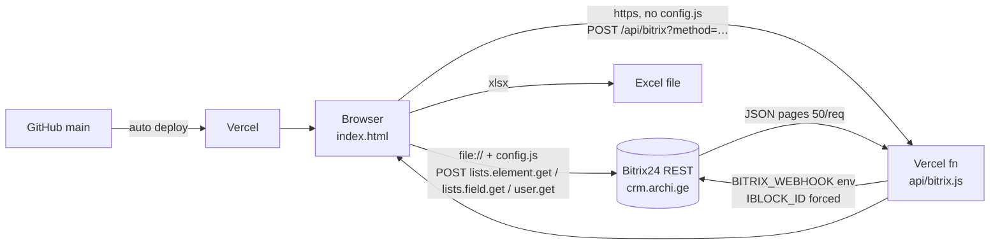

<!-- last-synced: 2026-09-09, commit: 0ec4ae5 -->
# Architecture — floor responsibility report

## Components
| Component | Location | Responsibility |
|---|---|---|
| Report page | `index.html` | fetch, model, render, filters, Excel export, error UI |
| Local config | `config.js` (gitignored), template `config.example.js` | `window.ARCHI_CONFIG` = webhook, iblock id/type; only for `file://` / dev |
| Vercel proxy | `api/bitrix.js` | forwards whitelisted REST methods to Bitrix using `BITRIX_WEBHOOK` env; forces list id |
| Bitrix24 REST | crm.archi.ge `/rest/<user>/<code>/` | source of truth: list 82, list fields, users |
| CDN | cdnjs (SheetJS 0.18.5), Google Fonts | Excel writer, Georgian font |
| Vercel | project `floor-gadanacileba` | static hosting of `index.html` + serverless function; auto-deploy from GitHub `main` |

## Data flow

| Step | From → To | Data |
|---|---|---|
| 1 | page → Bitrix (direct or via proxy) | `lists.element.get` ×N pages, `lists.field.get` (parallel) |
| 2 | page → Bitrix | `user.get` with unique `PROPERTY_434` ids (≤50 per call) |
| 3 | page (memory) | `buildModel` → projects, managers, cells, owners |
| 4 | page → DOM | `render()` on every filter change; no re-fetch |
| 5 | page → file | `exportExcel()` from current view |

Mode selection (`index.html` `CONFIG`): `ARCHI_CONFIG.webhook` present → direct; else if `location.protocol` is http(s) → `/api/bitrix`; else error "config.js არ მოიძებნა".

## Extension points
- `CONFIG.props` — remap Bitrix property ids without touching logic.
- `ALLOWED_METHODS` in `api/bitrix.js` — the only place to widen proxy access (requires DECISIONS entry).
- `createMultiSelect({getItems, selected, onChange})` — reusable for further filters.
- `cellData(pid, mid)` — single source for cell text/conflicts; used by both `render()` and `exportExcel()`.
- `ARCHI_CONFIG.proxy` — override proxy path if hosted elsewhere than Vercel.

## Not present (by design)
- No database, no cache, no server state, no auth, no writes to Bitrix.
